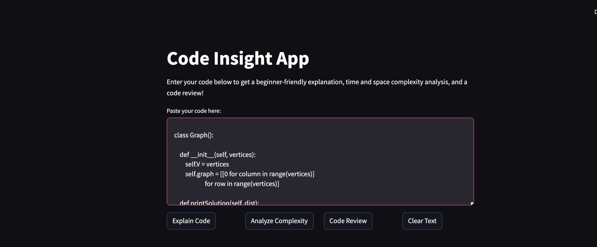

# 🚀 AI-Powered Code Reviewer using LLaMA 3 & Groq Cloud  

An AI-driven tool that explains code, analyzes time & space complexity, and provides constructive code reviews using **LLaMA 3.1-70B** via **Groq Cloud** and **LangChain**.

## 🌟 Features  
✅ **Code Explanation** – Breaks down complex code for beginners.  
✅ **Time & Space Complexity Analysis** – Provides **Big-O** notation for performance insights.  
✅ **Code Review & Feedback** – Offers best practices, efficiency improvements, and optimizations.  
✅ **Streamlit UI** – User-friendly interface for quick analysis.  
✅ **LLM-Powered** – Uses **Groq Cloud** for fast, high-performance AI processing.  

---

## 📌 Tech Stack  
- **Python** 🐍  
- **Streamlit** (UI Framework)  
- **LangChain** (Prompt & Model Management)  
- **Groq Cloud** (LLaMA 3.1-70B API)  
- **OpenAI Prompt Engineering**  

---
## Installation

Use the package manager [pip](https://pip.pypa.io/en/stable/) to install the necessary packages.

```bash
pip install -r requirements.txt
```

## Usage

Run the application with the following command:

```bash
streamlit run app.py
```
## 📷 Application Screenshot

